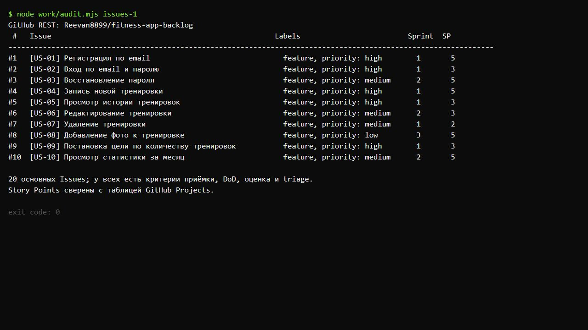
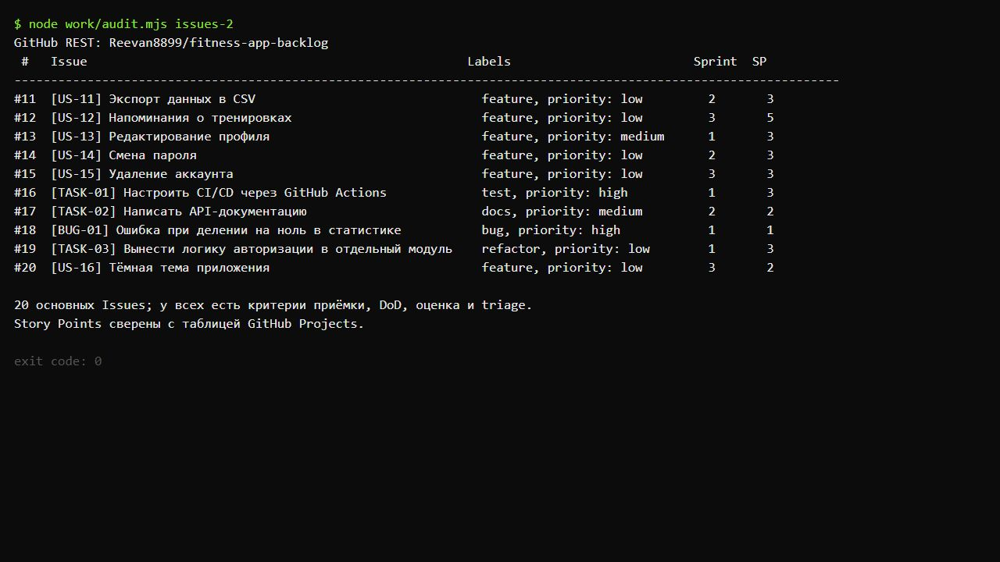
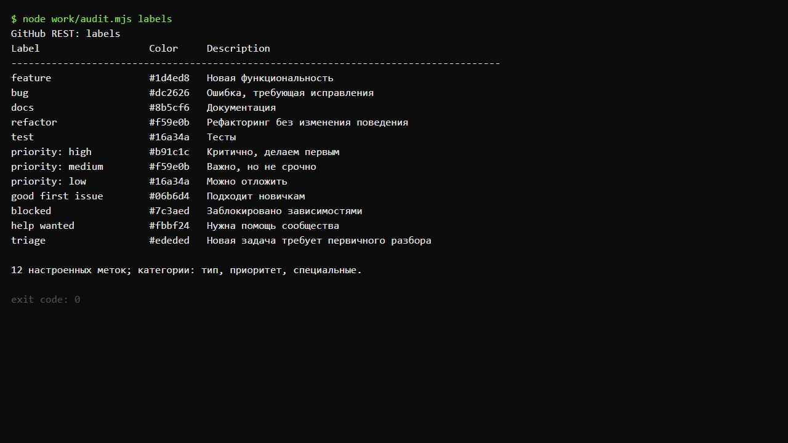
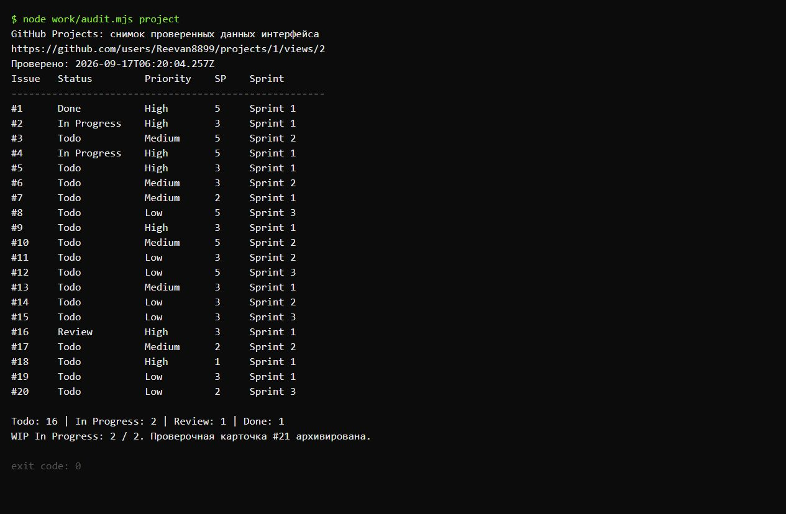
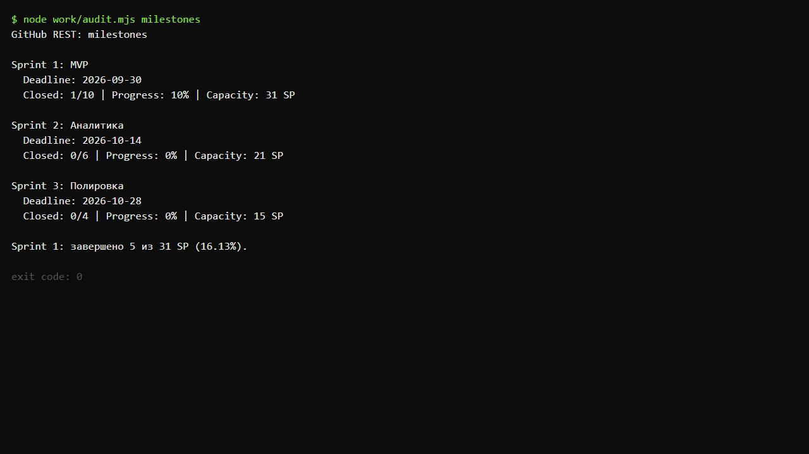
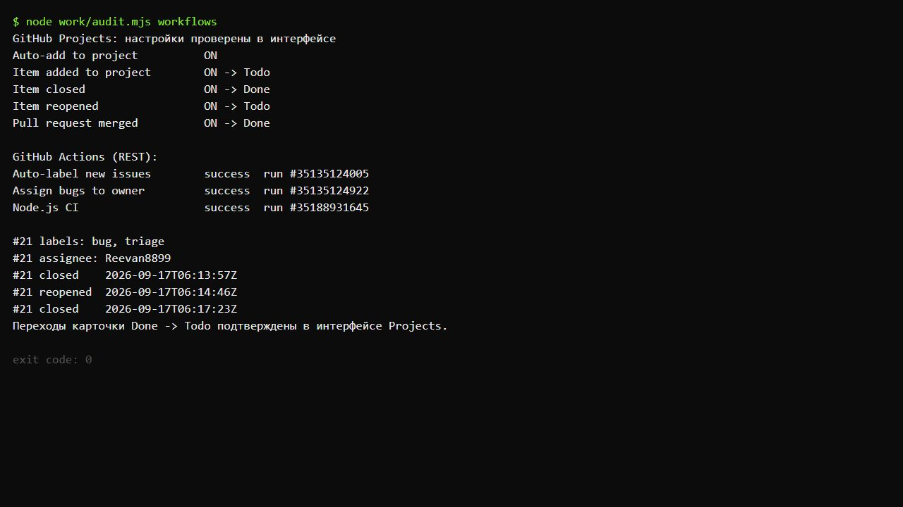
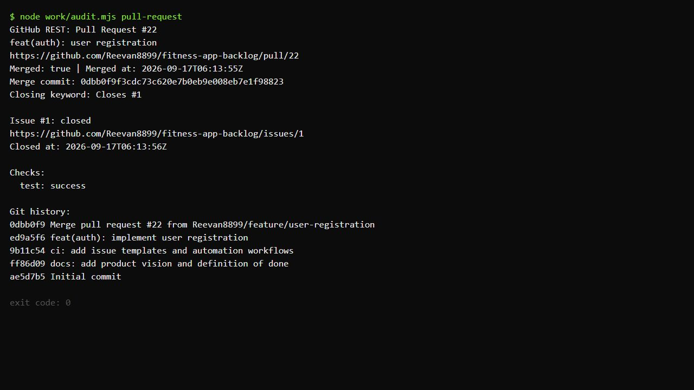
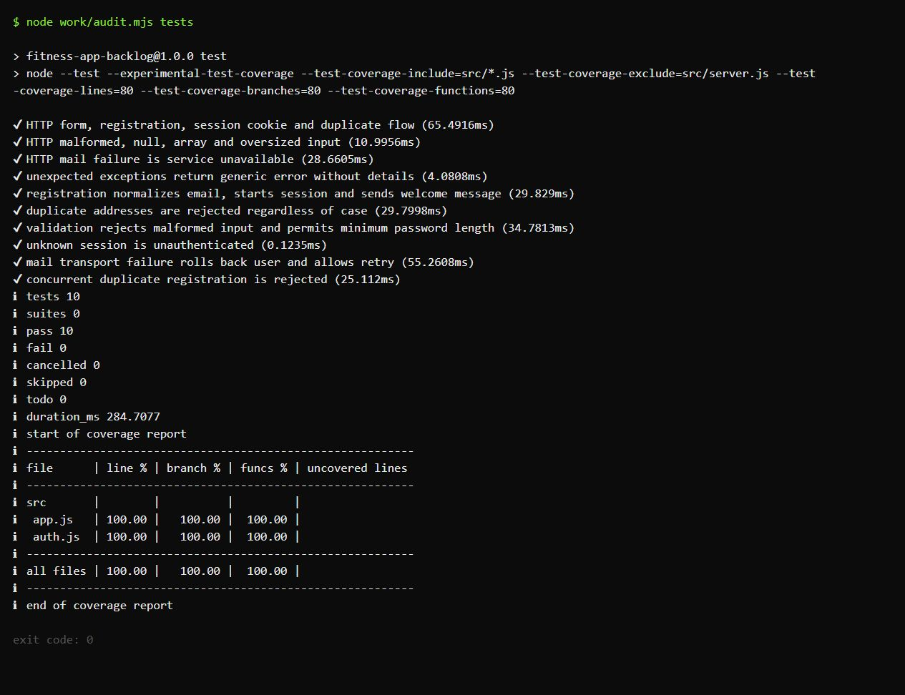
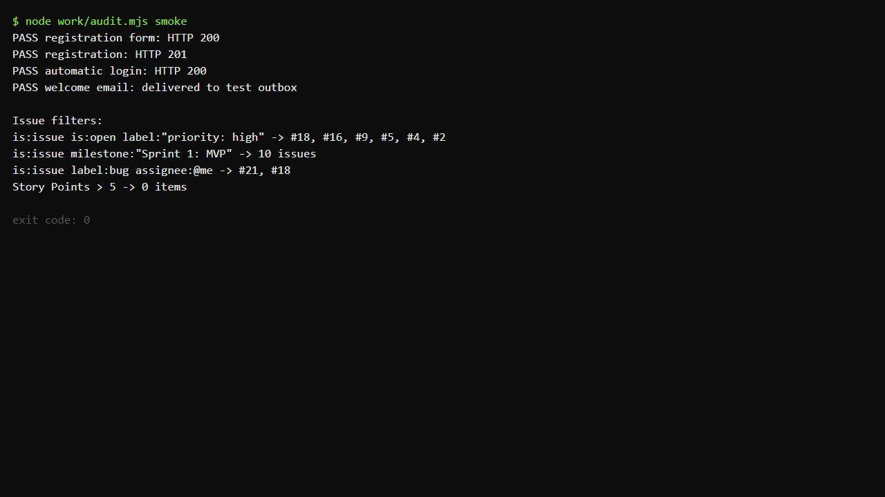

# Практическая работа №3

**Тема:** GitHub Issues и Projects как Product Backlog.  
**Выполнил:** Киреев Александр Сергеевич.  
**Группа:** М-25 ИО.  
**GitHub:** Reevan8899.  
**Дата выполнения:** 16–17 сентября 2026 года.  
**Стек:** Node.js, JavaScript, стандартная библиотека Node.js, node:test.

## Цель работы

Освоить ведение Product Backlog фитнес-приложения с помощью GitHub Issues, Projects, Labels, Milestones и Actions. Проверить связь требования с кодом через Pull Request и автоматическое закрытие Issue.

## Ссылки на результаты

- [Публичный репозиторий fitness-app-backlog](https://github.com/Reevan8899/fitness-app-backlog).
- [Публичная Kanban-доска](https://github.com/users/Reevan8899/projects/1/views/1).
- [Таблица Backlog · Story Points](https://github.com/users/Reevan8899/projects/1/views/2).
- [Все Issues](https://github.com/Reevan8899/fitness-app-backlog/issues?q=is%3Aissue).
- [Labels](https://github.com/Reevan8899/fitness-app-backlog/labels), [Milestones](https://github.com/Reevan8899/fitness-app-backlog/milestones), [Actions](https://github.com/Reevan8899/fitness-app-backlog/actions).
- [Встроенные Workflows](https://github.com/users/Reevan8899/projects/1/workflows), [Insights / Burn up](https://github.com/users/Reevan8899/projects/1/insights).
- [Объединённый Pull Request №22](https://github.com/Reevan8899/fitness-app-backlog/pull/22) и [закрытый Issue №1](https://github.com/Reevan8899/fitness-app-backlog/issues/1).

## Выполнение основной части

### 1. Репозиторий и документация

Создан публичный репозиторий с лицензией MIT, README и .gitignore для Node.js. Добавлены docs/vision.md, docs/backlog.md и docs/definition-of-done.md. В Vision определены проблема, решение, аудитория и метрики: 1000 активных пользователей через три месяца, средняя сессия более пяти минут, удержание на седьмой день более 30%.

Репозиторий клонирован по HTTPS с существующей авторизацией Git Credential Manager. HTTPS заменяет приведённый в методичке SSH-адрес и не меняет результат работы.

### 2. Метки и User Stories

Настроены 12 меток: feature, bug, docs, refactor, test; priority: high, priority: medium, priority: low; good first issue, blocked, help wanted и triage. Цвета и описания основных меток соответствуют заданию. Сохранены также стандартные метки GitHub.

Созданы 20 основных Issues с пользовательской историей, проверяемыми критериями приёмки, чек-листом DoD, оценкой в Story Points и приоритетом MoSCoW. Для повторного использования добавлен шаблон .github/ISSUE_TEMPLATE/user-story.md. Приоритеты High/Medium/Low и MoSCoW описывают разные аспекты планирования: метки сохраняют распределение из задания, MoSCoW отражает необходимость функции для продукта.

Must включает основу MVP и критические технические задачи; Should — важные функции; Could — улучшения. Социальная лента и платная подписка отнесены к Won’t в текущем горизонте и не включены в 20 заданных задач.

### 3. Project и спринты

Создан и связан с репозиторием публичный Project Fitness App Backlog. На доске четыре колонки в порядке Todo → In Progress → Review → Done. В In Progress установлен WIP-лимит 2. Лимит показывает превышение визуально, но не запрещает добавление карточек.

Созданы поля Priority (High, Medium, Low), Story Points (Number) и Sprint (Sprint 1, Sprint 2, Sprint 3). Все три поля заполнены у каждой из 20 основных карточек. В числовом поле используются оценки из ряда 1, 2, 3, 5, 8, 13; в текущем наборе задач достаточно оценок 1–5.

| Milestone | Дедлайн | Задач | Ёмкость | Закрыто | Прогресс по числу задач |
|---|---|---:|---:|---:|---:|
| Sprint 1: MVP | 30.09.2026 | 10 | 31 SP | 1 | 10% |
| Sprint 2: Аналитика | 14.10.2026 | 6 | 21 SP | 0 | 0% |
| Sprint 3: Полировка | 28.10.2026 | 4 | 15 SP | 0 | 0% |

Дедлайны рассчитаны от начала работы 16.09.2026: +2, +4 и +6 недель. Общая ёмкость — 67 SP. В Sprint 1 завершены 5 из 31 SP, то есть 16,13% оценки объёма работ. Процент Milestone рассчитан по количеству Issues, поэтому отличается от доли Story Points.

Итоговое распределение основных карточек: Todo — 16, In Progress — 2 (#2, #4), Review — 1 (#16), Done — 1 (#1). Статусы #2 и #4 демонстрируют планирование параллельной работы; реализация этих функций не заявляется. CI по #16 настроен и оставлен на проверке. Служебная проверочная Issue #21 закрыта, а её карточка архивирована после проверки, поэтому на основной доске ровно 20 карточек.

### 4. Автоматизация

В интерфейсе Projects проверены включённые правила:

| Правило | Результат |
|---|---|
| Auto-add to project | Новые Issues репозитория по фильтру is:issue is:open добавляются в Project |
| Item added to project | Новая карточка получает Todo |
| Item closed | Закрытая карточка получает Done |
| Item reopened | Переоткрытая карточка получает Todo |
| Pull request merged | Карточка объединённого PR получает Done |

Workflow .github/workflows/auto-label.yml использует actions/github-script@v7 и добавляет triage новой Issue. В отличие от сокращённого примера методички, явно указано permissions: issues: write. Метка triage создана заранее.

Для Issue #21 проверено: автоматическое добавление на доску, появление triage, назначение исполнителя при метке bug, закрытие → Done, переоткрытие → Todo, повторное закрытие → Done. Переходы проверены в интерфейсе Projects; закрытия и переоткрытие также подтверждены журналом GitHub API. Успешные запуски Actions доступны по ссылкам:

- [Автоматическая метка](https://github.com/Reevan8899/fitness-app-backlog/actions/runs/35135124005).
- [Автоназначение bug](https://github.com/Reevan8899/fitness-app-backlog/actions/runs/35135124922).
- [CI после слияния](https://github.com/Reevan8899/fitness-app-backlog/actions/runs/35188931645).

Важно различать два механизма: фраза Closes #1 закрывает связанную Issue при объединении PR в main; правило Item closed переводит её карточку в Done. Само правило Pull request merged управляет статусом карточки PR.

### 5. Регистрация на Node.js и связь с Issue

В ветке feature/user-registration реализованы форма регистрации, функция register(), валидация email и пароля, проверка подтверждения и повторного email, хеширование пароля scrypt, создание сессии и приветственное письмо через тестовый почтовый транспорт. HTTP-обработчики находятся в src/app.js, логика регистрации — в src/auth.js.

Коммит ed9a5f6 содержит Closes #1. В описании PR №22 повторена эта связь и перечислены команды проверки. После успешного CI PR объединён в main коммитом 0dbb0f9; Issue №1 автоматически закрылась, карточка стала Done.

Проверки: 10 тестов прошли, ошибок нет. Покрытие app.js и auth.js — 100% строк, ветвей и функций; CI требует не менее 80%. Файл запуска server.js исключён из расчёта покрытия. Smoke-тест проверяет форму (200), регистрацию (201), автоматический вход (200) и наличие письма в тестовом outbox.

Учебные ограничения: пользователи, сессии и outbox хранятся в памяти. Внешняя почтовая служба и постоянная БД не подключены. Локальный smoke-тест служит проверкой учебного staging, а CI сохраняет staging-архив; внешнего развёртывания нет. Независимое ревью и приёмка реальным Product Owner не выполнялись, соответствующие пункты DoD не отмечены выполненными.

Для запуска:

```sh
git clone https://github.com/Reevan8899/fitness-app-backlog.git
cd fitness-app-backlog
npm ci
npm test
npm run smoke
npm start
```

Форма доступна по адресу http://127.0.0.1:3000. Подробности запросов и ответов — в docs/api.md.

### 6. Анализ и фильтры

В Insights открыт встроенный Burn up. История содержит создание задач 16.09 и закрытие регистрации 17.09. Проверочная карточка затем архивирована и не входит в окончательную аналитику основного backlog.

Проверены выборки:

- is:issue is:open label:"priority: high" — #2, #4, #5, #9, #16, #18.
- is:issue milestone:"Sprint 1: MVP" — 10 Issues.
- is:issue label:bug assignee:@me — #18 и служебная #21, включая закрытые задачи.
- Story Points > 5 — 0 карточек в текущем наборе.

## Таблица 20 основных Issues

| № | Заголовок | Метки | Milestone | SP |
|---|---|---|---|---:|
| [#1](https://github.com/Reevan8899/fitness-app-backlog/issues/1) | [US-01] Регистрация по email | feature, priority: high, triage | Sprint 1: MVP | 5 |
| [#2](https://github.com/Reevan8899/fitness-app-backlog/issues/2) | [US-02] Вход по email и паролю | feature, priority: high, triage | Sprint 1: MVP | 3 |
| [#3](https://github.com/Reevan8899/fitness-app-backlog/issues/3) | [US-03] Восстановление пароля | feature, priority: medium, triage | Sprint 2: Аналитика | 5 |
| [#4](https://github.com/Reevan8899/fitness-app-backlog/issues/4) | [US-04] Запись новой тренировки | feature, priority: high, triage | Sprint 1: MVP | 5 |
| [#5](https://github.com/Reevan8899/fitness-app-backlog/issues/5) | [US-05] Просмотр истории тренировок | feature, priority: high, triage | Sprint 1: MVP | 3 |
| [#6](https://github.com/Reevan8899/fitness-app-backlog/issues/6) | [US-06] Редактирование тренировки | feature, priority: medium, triage | Sprint 2: Аналитика | 3 |
| [#7](https://github.com/Reevan8899/fitness-app-backlog/issues/7) | [US-07] Удаление тренировки | feature, priority: medium, triage | Sprint 1: MVP | 2 |
| [#8](https://github.com/Reevan8899/fitness-app-backlog/issues/8) | [US-08] Добавление фото к тренировке | feature, priority: low, triage | Sprint 3: Полировка | 5 |
| [#9](https://github.com/Reevan8899/fitness-app-backlog/issues/9) | [US-09] Постановка цели по количеству тренировок | feature, priority: high, triage | Sprint 1: MVP | 3 |
| [#10](https://github.com/Reevan8899/fitness-app-backlog/issues/10) | [US-10] Просмотр статистики за месяц | feature, priority: medium, triage | Sprint 2: Аналитика | 5 |
| [#11](https://github.com/Reevan8899/fitness-app-backlog/issues/11) | [US-11] Экспорт данных в CSV | feature, priority: low, triage | Sprint 2: Аналитика | 3 |
| [#12](https://github.com/Reevan8899/fitness-app-backlog/issues/12) | [US-12] Напоминания о тренировках | feature, priority: low, triage | Sprint 3: Полировка | 5 |
| [#13](https://github.com/Reevan8899/fitness-app-backlog/issues/13) | [US-13] Редактирование профиля | feature, priority: medium, triage | Sprint 1: MVP | 3 |
| [#14](https://github.com/Reevan8899/fitness-app-backlog/issues/14) | [US-14] Смена пароля | feature, priority: low, triage | Sprint 2: Аналитика | 3 |
| [#15](https://github.com/Reevan8899/fitness-app-backlog/issues/15) | [US-15] Удаление аккаунта | feature, priority: low, triage | Sprint 3: Полировка | 3 |
| [#16](https://github.com/Reevan8899/fitness-app-backlog/issues/16) | [TASK-01] Настроить CI/CD через GitHub Actions | test, priority: high, triage | Sprint 1: MVP | 3 |
| [#17](https://github.com/Reevan8899/fitness-app-backlog/issues/17) | [TASK-02] Написать API-документацию | docs, priority: medium, triage | Sprint 2: Аналитика | 2 |
| [#18](https://github.com/Reevan8899/fitness-app-backlog/issues/18) | [BUG-01] Ошибка при делении на ноль в статистике | bug, priority: high, triage | Sprint 1: MVP | 1 |
| [#19](https://github.com/Reevan8899/fitness-app-backlog/issues/19) | [TASK-03] Вынести логику авторизации в отдельный модуль | refactor, priority: low, triage | Sprint 1: MVP | 3 |
| [#20](https://github.com/Reevan8899/fitness-app-backlog/issues/20) | [US-16] Тёмная тема приложения | feature, priority: low, triage | Sprint 3: Полировка | 2 |

## Дополнительные задания

**B. Таблица со Story Points.** Создано представление Backlog · Story Points с полями Priority, Story Points и Sprint. Сортировка по Story Points по возрастанию сохранена для всех пользователей вида. Ёмкость Sprint 1: 5 + 3 + 5 + 3 + 2 + 3 + 3 + 3 + 1 + 3 = **31 SP**.

**C. Назначение по метке.** Workflow .github/workflows/assign-bug.yml реагирует на событие issues:labeled и при bug назначает Issue на Reevan8899 через actions/github-script@v7. Проверено на #18 и отдельной #21: исполнитель появился автоматически, запуск завершился success.

**D. Шаблон Pull Request.** Создан .github/pull_request_template.md с разделами «Что сделано», «Как проверить», «Связанные Issues». При открытии формы PR №22 шаблон автоматически подставился; затем заполнен фактическими результатами.

Выполнены три дополнительных задания при требовании минимум двух. Задания A и E не выбирались; искусственное закрытие шести невыполненных продуктовых задач не проводилось.

## Скриншоты

По индивидуальному требованию использован формат чистой консоли: без оконных заголовков, декоративных подписей, ФИО и группы на изображениях. Это снимки работающей локальной веб-консоли с реальным выводом Node.js. Списки Issues, Labels, Milestones, PR и Actions получены запросами GitHub REST API. Данные полей и Workflows Projects выведены из сохранённых наблюдений интерфейса; время проверки указано в консоли. Это не снимки графической доски GitHub — её можно открыть по публичной ссылке выше. Необработанные текстовые результаты приложены в папке logs.



















## Ответы на контрольные вопросы

**1. Чем GitHub Projects отличается от Trello и Jira?**  
Projects тесно связан с Issues и Pull Requests: изменения задач отражаются в таблице и доске. Trello ориентирован прежде всего на карточки и доски. Jira предоставляет более широкий набор средств управления разработкой, схем процессов и отчётности. Projects удобно использовать, когда код и задачи уже находятся в GitHub.

**2. Зачем Milestones, если есть Project и Labels?**  
Milestone объединяет задачи репозитория в спринт или релиз, задаёт дедлайн и показывает долю закрытых задач. Project организует представления и рабочие статусы; Labels описывают тип, приоритет и другие признаки. Эти инструменты дополняют друг друга.

**3. Как связать Issue с коммитом? Какие ключевые слова используются?**  
Номер #N в сообщении коммита создаёт ссылку. Closes #N, Fixes #N и Resolves #N обозначают закрытие задачи при попадании изменений в ветку по умолчанию. Такие же ключевые слова можно указать в описании PR, направленного в main. Refs #N служит обычной ссылкой и автоматически Issue не закрывает.

**4. Что произойдёт с карточкой, если закрыть Issue?**  
При включённом Item closed → Set status to Done карточка перейдёт в Done. Правило настраивается в Project → Workflows. Для обратного перехода включается Item reopened → Todo. Без соответствующего правила статус карточки не следует считать автоматически настроенным.

**5. Как формулировать User Story? Что такое критерии приёмки?**  
Формат: «Как <роль>, я хочу <действие>, чтобы <ценность>». Историю желательно делать независимой, обсуждаемой, ценной, оцениваемой, небольшой и проверяемой — INVEST. Критерии приёмки описывают конкретные проверяемые результаты, включая ошибки и граничные случаи. Например, пароль короче восьми символов отклоняется, занятый email возвращает ошибку.

**6. Что такое WIP-лимит и как его реализовать?**  
Это ограничение количества одновременно выполняемых задач. В меню колонки доски выбирается Set limit и вводится число. Для In Progress установлен лимит 2. GitHub подсвечивает превышение, но не блокирует перенос; соблюдение лимита остаётся правилом команды. См. [настройку колонок](https://docs.github.com/en/issues/planning-and-tracking-with-projects/customizing-views-in-your-project/customizing-the-board-layout).

**7. Какие встроенные Workflows доступны?**  
В текущем интерфейсе доступны Auto-add to project, Auto-add sub-issues to project, Item added to project, Item closed, Item reopened, Pull request linked to issue, Pull request merged, Auto-close issue, Auto-archive items, Code changes requested и Code review approved. Они добавляют и архивируют элементы, меняют статусы и связывают работу над кодом с доской. Список и доступность могут меняться; в отчёте приведён проверенный интерфейс.

**8. Как построить Burndown без сторонних инструментов?**  
Нужно фиксировать объём оставшейся работы на конец каждого дня. Для постоянного состава спринта remaining(d) = первоначальные SP − сумма SP завершённых задач к дню d. При изменении состава отдельно учитываются добавленные и исключённые SP. В Projects Insights можно использовать исторический график открытой работы по времени, если нужная агрегация доступна. Встроенный Burn up показывает накопленное выполнение и не является тем же самым графиком. Для точного собственного Burndown можно ежедневно сохранять значения GitHub Actions и строить SVG скриптом Node.js в репозитории. В этой работе задание E не выполнялось. См. [описание Insights](https://docs.github.com/en/enterprise-cloud%40latest/issues/planning-and-tracking-with-projects/viewing-insights-from-your-project/about-insights-for-projects).

**9. В чём преимущество Product Backlog прямо в GitHub?**  
Требование, обсуждение, код, тесты и PR находятся рядом. Связь Issue → коммит → PR обеспечивает трассируемость; автоматизация уменьшает ручное обновление статусов, а публичные ссылки упрощают проверку результата.

**10. Что такое Definition of Done?**  
Это единое для команды определение готовой работы: тесты, ревью, документация, проверка на стенде и приёмка. DoD предотвращает ситуацию, когда «код написан» ошибочно считается полностью поставленной функцией. Критерии приёмки относятся к конкретной истории, а DoD — к общему качеству завершения задач.

## Трудности и решения

1. Пример реализации в методичке дан на Python. Использованы эквиваленты для Node.js: src/auth.js, node:test и npm-команды; структура и смысл задания сохранены.
2. Встроенный браузер сначала не был авторизован. Вход выполнил владелец аккаунта; пароль и токены в отчёт не включались.
3. Сохранённые Git-учётные данные не имели разрешения project для GraphQL. Репозиторий и Issues настроены через API, а Projects — через авторизованный интерфейс. Расширение разрешений не потребовалось.
4. В текущем GitHub создание поля сначала предлагает Issue fields. Для требований практики выбраны именно Project fields; после настройки таблицы сохранены общие параметры вида.
5. Автометка требует права issues: write и существующей triage. Оба условия добавлены, успешные запуски проверены.
6. GitHub использует общую нумерацию Issues и PR. После 20 основных Issues и проверки #21 Pull Request получил номер #22; это нормальное поведение.
7. Пользователь попросил только консольные снимки, хотя методичка перечисляет экраны GitHub. В отчёт включены консольные проверки и публичные ссылки, а способ получения снимков явно указан.

## Результат

Создан и заполнен Product Backlog из 20 Issues; настроены 12 меток, четыре статуса, три пользовательских поля и три Milestones. Проверены автоматизации Projects и Actions. Реализована учебная регистрация на Node.js, PR объединён, связанная Issue закрыта автоматически. Выполнены дополнительные задания B, C и D.
